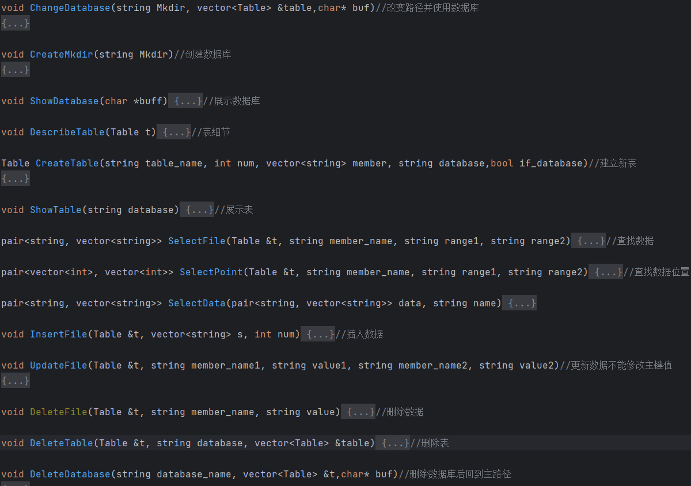

# Luki_ST SQL 数据库系统详细设计报告

[TOC]

## 项目简介

- 项目名称：Luki_ST SQL  

- 主要目的：通过实验加深对MySQL及其内部实现技术的理解。实践系统软件开发的工程化方法，并且实现MySQL中基本的，建数据库、建表、增删改查等操作。利用B+树存储主键，multimap存储其他索引。     

- 编程语言：C++ 

- 开发方式：独立开发、自底向上模块化

- 运行平台：Windows系统  - 运行方式：单用户本地运行

- 依赖相关：底层文件及文件夹操作接口依赖于Windows操作系统，其他部分皆为标准C++语言实现。 

- 代码长度：约7000行  

- 参考资料：   

  - 项目借鉴：21级HacknetOS、CSDN、chatGPT、OIwiki中的B+树介绍

  - （本项目完全独立开发、未利用人工智能撰写代码）

  - MySQL学习：  [https://github.com/baagod/sql_node/blob/master/mysql/MySQL%E5%AD%A6%E4%B9%A0%E7%AC%94%E8%AE%B0.md](https://github.com/baa-god/sql_node/blob/master/mysql/MySQL学习笔记.md)   

  - B+树相关算法：

    [B+树介绍](https://www.cnblogs.com/wade-luffy/p/6292784.html)     [B+树的几点总结](https://www.jianshu.com/p/6f68d3c118d6)   

    [B树和B+树的插入、删除图文详解](https://www.cnblogs.com/nullzx/p/8729425.html)

    [从MySQL Bug#67718浅谈B+树索引的分裂优化](https://www.cnblogs.com/nullzx/p/8729425.html) 

  - 文件操作相关算法： 

    [MySQL存储引擎详解](https://blog.csdn.net/rongtaoup/article/details/125819682?ops_request_misc=%7B%22request%5Fid%22%3A%22168464872316800197010751%22%2C%22scm%22%3A%2220140713.130102334..%22%7D&request_id=168464872316800197010751&biz_id=0&spm=1018.2226.3001.4187)  

## 系统结构

### 系统结构图


### 程序文件清单

|              | 程序文件作用     | 程序文件名     | 简要描述                   |
| ------------ | ---------------- | -------------- | -------------------------- |
| **用户接口** | 文件的写入与读取 | file.h         | 进行索引与文件的读入与修改 |
|              | 控制台窗口操作   | cmd.h          | 清屏等                     |
|              | 颜色操作         | color.h        | 字体背景颜色               |
|              | 字体相关         | keyboard.h     | 字体大小改变，密码输入     |
|              | 存储Table（表）  | Table.h        | 存储表数据                 |
|              | 处理读入类型     | typetree.h     | 处理读入类型               |
| **系统内核** | B+树模块         | bplus_tree.h   | B+树实现文件               |
|              | 语法分析模块     | Lexer.h        | 语法分析文件               |
|              | 查找单元         | select_one     | 查找单元                   |
|              | 拆分模块         | operation.h    | 中间模块                   |
| **系统集成** | 语法分析模块     | search_error.h | 语法分析，语句查错         |
|              | 主程序           | main.cpp       | 主函数                     |

​		

### 程序设计目标

#### 系统功能

设计并实现一个精简单用户SQL engine ，并在其中实现基本的数据库及表的操作功能。 其中：

- 表定义中的列(属性)至少支持三种数据类型：整型(int)、浮点型(double)、字符型数组(string)

- 每张表必须有一个主键，且只有一个主键，单属性主键

- 如果没有设定主键，则将默认将一个类型为INT的属性设置为主键（也就是必须有一个INT）

- 实现数据库的创建/删除，实现表的创建/删除

- 实现记录的插入、删除、主键查找、非主键查找、更新（但不能更新主键值）

- 数据的快速查找：在十万个数据的表中，第一次查找数据需要从文件中读取数据存入b+树，用时0.9s，第二次查找数据只需0.005s

  

  **更新：测试了一百万组数据的查找（未实现页式存储，插入较慢）**

  ​		执行一百万组数据的插入：用时一小时

  

  ​		从一百万组数据中检索所需数据：第一次10s（载入索引）

  ​		随后只需要少于0.01s的时间。

  

- 支持AND、OR、BETWEEN、IN用于数据查找的标识符

- 对于查找运算符，目前只支持”=“、”>=“、"<="三个

  

#### 系统结构

- 模块化结构
- 内核部分B+树实现索引
- Lexer模块提供词法分析
- file部分提供增删改查的文件操作
- search_error模块利用Lexer模块进一步进行语法分析，如果找出语法错误将会在运行时提示，这部分的语法报错几乎涵盖所有错误。
- 各个模块只向上负责

## 程序模块说明

**以下内容为程序关键部分简介，程序细节请参考源码以及注释**

### B+树 模块

1. 目标：通过B+树，创建和读写文件索引，提供数据库快速检索

2. 程序文件：bplus_tree.h 

3. 主要数据结构及接口说明

4. 接口实现

   - 实现对关键字的查找、插入和删除操作
   - 打印B+树结点信息

5. 主要数据结构及接口说明:

   **B+树节点模块**

```c++
class BPlus_tree_node
{
public:
    // leaf_node的属性：①②③⑤⑥⑦
    // index_node的属性：①②④⑤
    bool is_leaf;                               // ①是否为叶子节点
    vector<key_type> keys;                      // ②关键字
    vector<value_type> values;                  // ③值
    vector<BPlus_tree_node *> children;         // ④孩子节点
    BPlus_tree_node *parent = nullptr;          // ⑤父亲节点
    BPlus_tree_node *next = nullptr;            // ⑥右兄弟节点
    BPlus_tree_node *left = nullptr;            // ⑦左兄弟节点

    // 初始化一个新节点时必须定义其是否为叶子节点
    explicit BPlus_tree_node(bool a) : is_leaf(a)
    {};

    // 清空节点，防止内存泄露
    void clear();
};

```

​	**B+树模块**

```c++
class BPlus_tree
{
private:
    BPlus_tree_node<key_type, value_type> *root = nullptr;    // 初始化时为空树
public:
    BPlus_tree() = default;

    // 对外接口：插入函数
    // 如果为空树则直接新建根节点
    // 如果不为空树则调用内部查找函数
    void insert_value(key_type key, const value_type &value);

    // 对外接口：查找函数
    // 如果为叶子节点则直接在当前节点找到key
    // 如果不是叶子节点则执行内部查找函数
    // 执行内部查找函数后若搜索到叶子节点则返回value值
    value_type search_value(key_type key);

    // 对外接口：删除函数
    // 传入key值，找到对应的value将其删除
    // 需要先调用找叶子节点的函数 find_key_node
    // 返回值为true则删除成功
    bool drop_value(key_type key);

    // 对外接口：修改函数
    // 如果为当前节点为叶子节点则直接在当前节点执行修改值的操作
    // 返回true则修改成功
    // 返回false则修改失败（没有找到该key）
    bool update(key_type key, value_type value);

    //对外接口：输出函数
    void print();

    // 对外接口：查找key是否存在
    bool if_key_exist(key_type key);

    // 对外接口：查找key区间内的value(使用于辅助索引,key是数字,value是主键)
    vector<key_type> search_range(key_type min_key, key_type max_key);

    // 对外接口：查找key区间内的value(使用于辅助索引,key是数字,value是主键)
    vector<key_type> search_range(key_type key, bool up);


private:
    // 中间函数
    // 在keys列表中找key对应的索引
    // 如果没找到则返回-1
    // 如果找到则返回该key对应的索引值
    // 该函数设置为全局函数
    // int find_key_index(const vector<key_type>& keys, key_type key);

    // 中间函数
    // 找key对应的索引位置的函数
    // 找到该关键字应插入的位置
    // 简单的二分查找
    // 返回值即为key对应的索引位置
    // 该函数设置为全局函数
    // int find_key_pos(const vector<key_type>&, key_type key);

    // 查找key所在的叶子节点的函数
    // 返回值为所寻找的叶子节点
    // 便于函数实现的中间函数
    BPlus_tree_node<key_type, value_type> *find_key_node(key_type key);

    // 内部插入函数
    // 该函数传入的node为为要插入的节点，下面判断node是否为叶子节点，如果不是叶子节点则继续递归该插入函数
    void internal_insert_value(BPlus_tree_node<key_type, value_type> *node, key_type key, value_type value);

    // 叶子节点分裂函数
    // 叶子节点分裂需要提一个key到父亲节点且保留该key在叶子节点中
    // 而索引节点分裂时提key但不需要保留key
    // 二者分裂有区别所以将二者分裂函数分开写
    void split_leaf_node(BPlus_tree_node<key_type, value_type> *leaf);

    // 非叶子节点分裂函数
    void split_index_node(BPlus_tree_node<key_type, value_type> *node);

    // 内部删除函数
    // 如果所在结点不是叶子节点，则需要递归往下搜索直到搜索到叶子节点
    // 找到叶子节点后才能进行删除操作
    bool internal_drop_value(key_type key);

    // 叶子节点合并函数
    void merge_leaf_into_left_sibling(BPlus_tree_node<key_type, value_type> *parent, int cur_pos, int left_pos);

    void merge_leaf_into_right_sibling(BPlus_tree_node<key_type, value_type> *parent, int cur_pos, int right_pos);

    // 叶子节点旋转函数
    void rotate_rightly_with_left_sibling(BPlus_tree_node<key_type, value_type> *parent, int cur_pos, int left_pos);

    void rotate_leftly_with_right_sibling(BPlus_tree_node<key_type, value_type> *parent, int cur_pos, int right_pos);

    // 索引节点整理函数（包含了合并和旋转）
    void index_balance(BPlus_tree_node<key_type, value_type> *node);

    // 索引节点合并函数
    void merge_index_into_left_sibling(BPlus_tree_node<key_type, value_type> *parent, int cur_pos, int left_pos);

    void merge_index_into_right_sibling(BPlus_tree_node<key_type, value_type> *parent, int cur_pos, int right_pos);

    // 索引节点旋转函数
    void
    index_rotate_rightly_with_left_sibling(BPlus_tree_node<key_type, value_type> *parent, int cur_pos, int left_pos);

    void
    index_rotate_leftly_with_right_sibling(BPlus_tree_node<key_type, value_type> *parent, int cur_pos, int right_pos);
};
```

**6.效率测试：**

对B+树的操作不涉及磁盘I/O，此处显示的是B+树在检索数据时的高效性。

实测一个拥有一千万的节点的B+树，检索10个连续数据只要0.015s。


实测一个拥有五千万的节点的B+树，检索10个连续数据只要0.33s。


### 语法分析模块

**1. Token模块**

```c++
// 用于标记模块类型
// Token 类型枚举
enum class TokenType
{
    // 关键字
    SELECT, FROM, WHERE, AND, OR, INSERT, AS, INTO, UPDATE, SET, BETWEEN, in, Delete, DROP, TABLE, DATABASE,
    SHOW, DATABASES, TABLES, DESCRIBE, USE, CREATE, INT, DOUBLE, STRING, PRIMARYKEY,
    // 特殊符号
    COMMA, SEMICOLON, LEFT_PAREN, RIGHT_PAREN, ALL, UNVALID,
    // 字面量
    IDENTIFIER, LITERAL,
    // 运算符
    BINARY_OPERATOR
};

// Token 类
class Token
{
public:
    Token(const enum TokenType& _type, const string& _value) : type(_type), value(_value) {}
    const enum TokenType getType() const
    {
        return type;
    }
    const string getValue() const
    {
        return value;
    }

private:
    enum TokenType type;
    string value;
};
```

**2. 词法分析模块**

```c++
// 词法分析器类
class Lexer
{
private:
    const string input;	// 用于存储原始语句
    int currentPos;		// 存储索引位置
    char currentChar;	// 存储当前索引下的特定字符

public:
    Lexer(const string& _input) : input(_input);

    Token get_NextToken();

private:
    // 中间封装函数
    void advance();	// 指针前进，含有超出范围的提示
    void back();	// 指针后退，含有超出范围的提示
    void skip_Whitespaces();	// 跳过空格
    
    Token readIdentifierToken();		// 读取标识符
    Token readLiteralToken();			// 读取字面量
    Token readStringLiteralToken();		// 读取字符串字面量
    Token readOperator();				// 读取符号，未知符号标记为Invalid
};
// 封装好的获取Token数组的函数
vector<Token> get_statement_tokens(string SQL_statement);	
// 用于测试的打印函数
void print_tokens(vector<Token> tokens);
```

**3. 语法分析逻辑**

- 第一步：获取Token数组
- 第二步：对Token数组进行语法分析，没有错误则进入文件交互
- 第三步：根据Token中的具体内容进行特定的文件交互操作

### 文件处理模块

1. 目标：通过利用B+树和multimap，创建和读写文件索引，提供数据库快速检索

2. 程序文件：file.h select_map.h

3. 主要数据结构及接口说明：

   

   

## 软件模块的物理分布

除数据文件在磁盘上外，其他都在内存中操作。


## 接口设计

对外提供的接口：

- 数据库创建
- 数据库删除
- 表的创建
- 表的删除
- 插入记录
- 删除记录
- 更新记录


## Luki_ST SQL使用手册（语法介绍）

**注：关键字必须大写**

**可以使用WHERE中含AND/OR的查询，但只能含一个AND或含一个OR，即不能够实现AND与OR同时存在的嵌套查询。**

```sql
-- exit 退出
exit;

-- cls 清屏
cls;

-- pwd 显示当前路径
pwd;

-- CREATE 新建数据库
CREATE DATABASE test;

-- USE 进入数据库
USE DATABASE test;

-- DROP 删除数据库
DROP DATABASE test;

-- SHOW 展示所有数据库
SHOW DATABASES;

-- CREATE 新建数据表
CREATE TABLE datasheet (id INT PRIMARYKEY, grade DOUBLE, name STRING);

-- DROP 删除数据表
DROP TABLE sheet;

-- DESCRIBE 展示表结构
DESCRIBE TABLE sheet;

-- SHOW 展示所有表
SHOW TABLES;

-- INSERT 插入数据
INSERT INTO sheet (1, 13.2, "lucy");

-- UPDATE 更新数据
UPDATE sheet SET grade = 2.3 WHERE id = 1;

-- DELETE 删除数据
DELETE FROM sheet WHERE id = 1;
DELETE FROM sheet WHERE id = 1 OR id = 5;
DELETE FROM sheet WHERE id = 1 AND grade = 13.2;

-- SELECT查找
SELECT * FROM sheet WHERE id = 1;
SELECT * FROM sheet WHERE id >= 2;
SELECT * FROM sheet WHERE id <= 3 OR id = 4;
SELECT * FROM sheet WHERE id BETWEEN 1 AND 2;
SELECT id,name FROM test WHERE id IN (1,2,3);
SELECT * FROM sheet;
```

## 语法报错介绍

**注意：由于时间紧迫，目前尚未实现WHERE中含有AND/OR 的精准报错 以及 WHERE 中查询数据类型与当前输入类型不符导致的程序闪退（例如id为INT型，WHERE id = ”a“此时程序闪退）**

**以下的报错并不涵盖所有的报错分析，用户可以自己运行程序进行尝试。**

**初次之外的报错几乎涵盖所有错误，做到保姆级报错。**


**支持多行输入：**


**捕捉未知非法符号**


**空语句**


**SELECT查找**


**INSERT插入**


**UPDATE更新**


**DELETE删除**（图中"id"is之间没有空格的bug已修复）


**CREATE建库**


**CREATE建表**


**DROP删表/库**


**若没找到表则输出Not Find Such Table!**


## 版本信息

- 2023/05/20      Beta1.0
